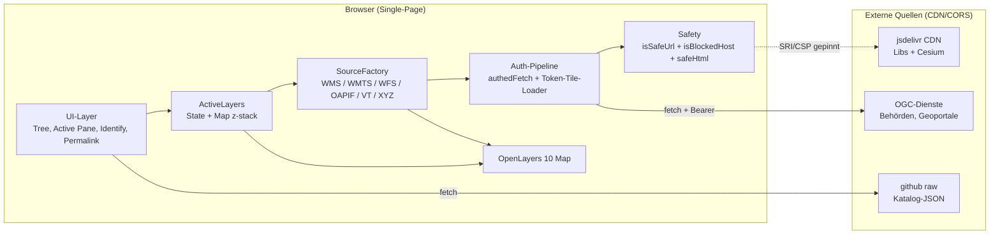
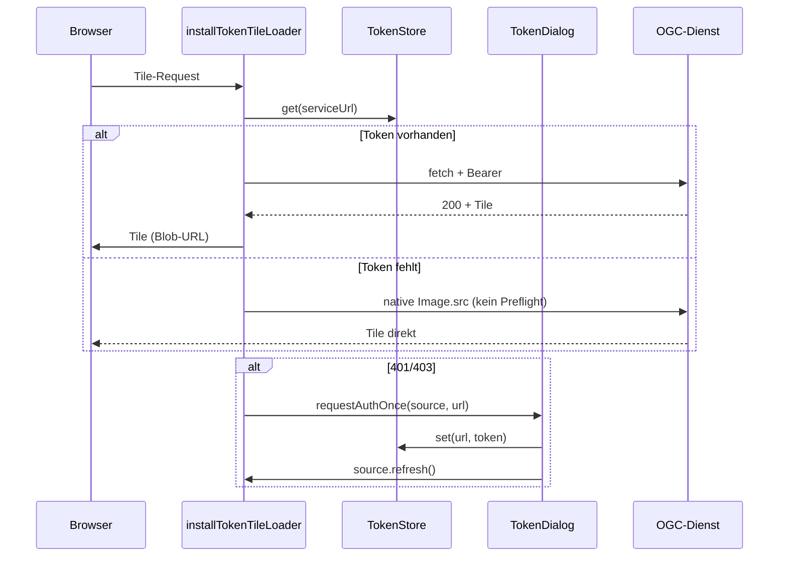
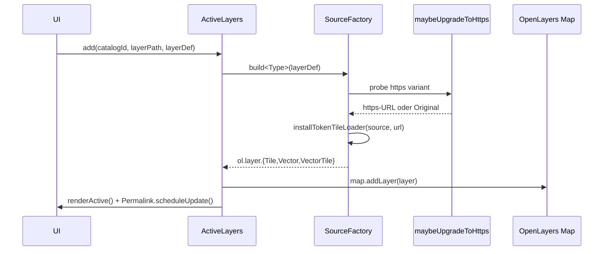

# GeoBasis Loader Web

> Webclient zum Erkunden offizieller Geobasisdienste der DACH-Region (Deutschland, Österreich, Schweiz) — direkt im Browser, ohne Installation, ohne Build-Schritt.

`GeoBasis Loader Web` ist eine schlanke, ausschließlich Client-seitig laufende Kartenanwendung, die die kuratierten Layer-Kataloge des QGIS-Plugins [`geoObserver/geobasis_loader`](https://github.com/geoObserver/geobasis_loader) aufruft und die enthaltenen OGC-Dienste (WMS, WMTS, WFS, OGC API Features, Vector Tiles) auf einer interaktiven OpenLayers-Karte sichtbar macht. Die gesamte Anwendung besteht aus einer einzigen HTML-Datei mit eingebettetem CSS und JavaScript; alle Abhängigkeiten werden mit Subresource-Integrity gegen ein öffentliches CDN gepinnt.

---

## Inhaltsverzeichnis

- [Funktionsumfang](#funktionsumfang)
- [Architektur](#architektur)
- [Tech-Stack](#tech-stack)
- [Schnellstart](#schnellstart)
- [Projektstruktur](#projektstruktur)
- [Designentscheidungen](#designentscheidungen)
- [Sicherheit](#sicherheit)
- [Katalog-Format](#katalog-format)
- [Konfiguration](#konfiguration)
- [Entwicklungs-Workflow](#entwicklungs-workflow)
- [Browser-Kompatibilität](#browser-kompatibilitt)
- [Status und Roadmap](#status-und-roadmap)
- [Mitwirken](#mitwirken)
- [Lizenz](#lizenz)

---

## Funktionsumfang

| Bereich | Beschreibung |
|---|---|
| **Katalog-Loader** | Lädt den Index `GeoBasis_Loader_v6_Kataloge.json` und die einzelnen Bundesland-/Landeskataloge live vom Upstream-Repository. |
| **Service-Typen** | `ogc_wms`, `ogc_wmts`, `ogc_wfs`, `ogc_api_features`, `ogc_vectorTiles`. `ogc_wcs` wird als nicht-visualisierbar markiert; `web` öffnet externe Links in einem neuen Tab. |
| **WMTS-Heuristik** | Etwa die Hälfte der `ogc_wmts`-Einträge sind tatsächlich XYZ-Tile-Templates (`{z}/{x}/{y}`, Bing-Quadkey `{q}`). Diese werden automatisch erkannt und über einen XYZ-Pfad geladen, statt Capabilities zu parsen. REST/KVP-Encoding wird beim echten WMTS-Pfad automatisch ermittelt. |
| **Identify-Tool** | Optional zuschaltbares Feature-Info-Werkzeug. Klick auf die Karte ruft parallel `GetFeatureInfo` (WMS) und `forEachFeatureAtPixel` (Vektor) für alle aktiven Layer auf und zeigt die Treffer in einem Tab-Popup. Antworten werden via DOMPurify mit strikter Allowlist sanitisiert. |
| **Auth-Pipeline** | Bearer-Token werden ausschließlich im RAM gehalten, niemals in URLs oder LocalStorage. Tile-Loader injizieren `Authorization`-Header per Fetch-Wrapper; `401/403` öffnet einen Token-Dialog mit Retry-Callback. Ein Source-weiter Lock verhindert Dialog-Spam bei parallel fehlschlagenden Tiles. |
| **Permalink** | Aktueller Katalog, aktive Layer (Pfad, Opazität, Sichtbarkeit), View (Zentrum, Zoom) und 3D-Status werden in den URL-Fragment serialisiert. 8 KB Hard-Cap, 250 ms Debounce. Tokens werden niemals serialisiert. |
| **Session-Export** | JSON-Export/Import der gleichen Daten plus PNG-Snapshot der Karte. Strikte Schema-Validierung beim Import (max. 100 Layer, Opazität-Clamping, Pfad/Key-Migration). |
| **3D-Modus** | Lazy-Load von Cesium + ol-cesium beim ersten Toggle. CSP enthält bereits `wasm-unsafe-eval` für Cesium-Worker. |
| **Drag-Reorder** | Aktive Layer können in der Reihenfolge sortiert werden (Touch-tauglich via Sortable.js). Die Listen-Reihenfolge entspricht der Z-Stack-Reihenfolge der Karte. |
| **Themes** | Hell/Dunkel-Schema über `color-scheme: light dark` und `light-dark()`-CSS-Funktion. Manueller Toggle überschreibt die System-Präferenz pro Session. |
| **SSRF-Hardening** | Service-URLs werden vor jeder Quellen-Instanziierung validiert; nicht-http(s)-Schemata sowie private IPv4/IPv6-Bereiche (Loopback, RFC1918, ULA, link-local, CGNAT, IPv4-mapped IPv6) sind hart blockiert. |
| **HTTPS-Upgrade** | Beim Aktivieren eines `http://`-Layers wird ein TLS-Probe ausgeführt; antwortet der Host auf HTTPS, wird die URL transparent ersetzt. Andernfalls bleibt es bei HTTP, mit sichtbarem `HTTP`-Warnhinweis. |
| **Internationalisierung** | UI vollständig in Deutsch. CRS-Definitionen für ETRS89-Varianten, MGI-Austria, S-JTSK-Krovak (Tschechien) und Schweiz LV03/LV95 vorregistriert. |

---

## Architektur

### Übersicht



### Module (innerhalb der `index.html`)

| Modul | Verantwortung | Datei-Ankerpunkt |
|---|---|---|
| `Catalogs` | Index + Bundesland-Kataloge nachladen, In-Memory-Cache. | `Catalogs.loadIndex` / `loadCatalog` |
| `SourceFactory` | Mappt Katalog-`type` auf OpenLayers-Source. Jede Methode ist `async` (HTTPS-Upgrade-Probe). | `SourceFactory.buildWMS/WMTS/WFS/...` |
| `ActiveLayers` | Aktive Layer-Liste, Drag-Reorder, Pending-Cancellation, Map-Z-Stack. | `ActiveLayers.add/remove/reorder` |
| `Identify` | Optionales Klick-Werkzeug. Tab-Popup mit ESC/Arrow-Navigation. Status: opt-in. | `Identify.setEnabled` |
| `TokenStore` + `TokenDialog` | Bearer-Token-Verwaltung. Ausschließlich In-Memory-Map. Retry-Callback-Plumbing. | `TokenStore.set/get` |
| `UI` | Katalog-Auswahl, Layer-Tree, Filter, Scope (aktueller Katalog vs. alle), Sidebar-State. | `UI.renderTree`, `UI._renderLayerLi` |
| `Permalink` | Fragment-Serialisierung, Restore, Debounce. | `Permalink.scheduleUpdate` |
| `ExportModule` | JSON-Session und PNG-Snapshot. Schema-Validierung beim Import. | `ExportModule.export/import` |
| `ThreeD` | Lazy-Loader für Cesium + ol-cesium beim ersten Toggle. | `ThreeD.toggle` |
| `Theme` | Hell/Dunkel-Schema-Override pro Session. | `Theme.toggle` |
| `Toast` | Statusbar-Benachrichtigungen. | `Toast.info/err/warn` |

### Auth-Flow



### Daten-/Schema-Flow eines Layer-Aktivierens



---

## Tech-Stack

Alle Abhängigkeiten via `<script>`/`<link>` mit SRI-Hash gegen `cdn.jsdelivr.net`. Keine npm-Toolchain.

| Bibliothek | Version | Zweck | Lazy |
|---|---|---|---|
| [OpenLayers](https://openlayers.org) | 10.3.1 | Kern-Karten-Engine | nein |
| [proj4js](https://github.com/proj4js/proj4js) | 2.12.1 | Nationale CRS (EPSG:25832, 2056, 31256, 31287, 5514, ...) | nein |
| [DOMPurify](https://github.com/cure53/DOMPurify) | 3.2.4 | Sanitiser für `GetFeatureInfo`-HTML | nein |
| [Sortable.js](https://github.com/SortableJS/Sortable) | 1.15.6 | Drag-Reorder der aktiven Layer (Touch-tauglich) | nein |
| [Floating UI](https://floating-ui.com) | 1.6.13 | Popup-Positionierung (flip, shift, offset) | nein |
| [ol-mapbox-style](https://github.com/openlayers/ol-mapbox-style) | aktuell | Vector-Tile-Style-Anwendung über `applyStyle` | nein |
| [Cesium](https://cesium.com/platform/cesiumjs/) | 1.123.0 | 3D-Globe | ja |
| [ol-cesium](https://github.com/openlayers/ol-cesium) | 2.18.0 | Synchronisation OL-Karte zu Cesium-Szene | ja |

**Größenbudget (gzipped Schätzung):** Sortable.js ~13 KB + Floating UI ~7 KB ≈ 20 KB Zusatz-Libraries. Gesamte Anwendung unter dem 70-KB-Limit für die einzelne HTML-Datei.

---

## Schnellstart

### Voraussetzungen

- Aktueller Browser (siehe [Browser-Kompatibilität](#browser-kompatibilitt))
- Windows mit PowerShell 5.1+ (für den mitgelieferten Dev-Server). Alternativ jeder beliebige HTTP-Server, der statische Dateien ausliefert.

### Lokal starten

```powershell
git clone https://github.com/<owner>/gbl_web.git
cd gbl_web
powershell -ExecutionPolicy Bypass -File .\serve.ps1
```

Anschließend im Browser öffnen:

```
http://127.0.0.1:8765/index.html
```

Beenden mit `Strg+C` in der PowerShell-Konsole.

> **Warum kein `file://`-Aufruf?** Die Content-Security-Policy setzt `default-src 'self'`. Beim Öffnen via `file://` ist der Origin `null`, und alle Fetch-/CORS-Aufrufe schlagen fehl. Der lokale HTTP-Server ist Pflicht.

### Unix-Alternative

Wer auf macOS/Linux entwickelt, kann jeden statischen Dateiserver verwenden:

```bash
python3 -m http.server 8765
# oder
npx serve -p 8765 .
# oder
caddy file-server --listen :8765
```

---

## Projektstruktur

```
gbl_web/
├── index.html      Gesamte Anwendung: HTML + CSS + JS in einer Datei
├── serve.ps1       Minimaler PowerShell-Dev-Server (gitignored)
├── CLAUDE.md       Interne Architektur-Notizen (für KI-gestützte Wartung)
├── README.md       Dieses Dokument
└── .claude/
    └── skills/
        └── powershell-httplistener-blocking-ctrl-c-trap/
            └── SKILL.md   Reusable PowerShell-Gotcha
```

Bewusst kein `package.json`, kein `node_modules`, kein Build-Output, kein Lockfile. Die einzige "Quelle der Wahrheit" ist `index.html`.

---

## Designentscheidungen

Die folgende Tabelle dokumentiert bewusste Entscheidungen und ihre Gegenkandidaten — sie ist die kanonische Referenz für künftige Refactorings.

### Frontend

| Entscheidung | Begründung | Verworfener Kandidat |
|---|---|---|
| OpenLayers (statt MapLibre/Leaflet) | Native Multi-CRS-Unterstützung via proj4 ist Pflicht. ETRS89-UTM-Zonen sind das Hauptarbeitspferd der DACH-Geodienste. | Leaflet (kein nativer Reprojection-Support), MapLibre (Mapbox-zentriert) |
| Single-File-HTML | Maximaler Auditierbarkeitsgrad, kein Build-Cache-Problem, kein Supply-Chain-Risiko über `node_modules`. | Vite/Rollup mit modularer Quelle |
| Eigenes CSS-Token-System via Custom Properties | Schlanker als Open Props, stilistisch fokussiert. OKLCH-Paletten + `light-dark()` erübrigen JS-Theme-Switcher. | Open Props, Tailwind |
| Inline-SVG-Icons | Kein zusätzlicher Roundtrip, kein Hydration-Mismatch, keine Lucide-Schrift-Loading-Schwankung. | Lucide-CDN |
| 30-LOC-Focus-Trap selbst geschrieben | `focus-trap` als externe Lib bringt 5+ KB für ein einzelnes Modal. | npm-`focus-trap` |
| Floating UI für Popup-Positionierung | CSS Anchor Positioning ist in Safari/Firefox 2026 noch nicht universell. Floating UI ist robust und ~7 KB gzipped. | Native CSS Anchor Positioning |
| View Transitions API hinter `@supports`-Guard | Schnelle Katalog-/Theme-Wechsel-Animation auf modernen Browsern; graceful degradation auf älteren. | JavaScript-Crossfade-Bibliotheken |

### Daten / Layer-Handling

| Entscheidung | Begründung |
|---|---|
| WMTS-Pfad mit XYZ-Heuristik | ~48 % der `ogc_wmts`-Katalog-Einträge sind XYZ-Templates. Capabilities-Fetch würde 404 liefern oder Garbage erzeugen. |
| REST-Encoding zuerst, KVP-Fallback | Die meisten deutschen WMTS-Server sind REST-only; einige (z. B. ältere Bundesländer) bieten ausschließlich KVP. |
| Layer-Identität via `country/[group/]layerKey` | Bare Keys (`flurstuecke`) kollidieren bis zu 12× über Bundesländer. Vollpfad ist eindeutig. |
| Parallele Identify-Queries mit Per-Layer-Timeout | Ein einzelner langsamer/toter Dienst blockiert nicht alle anderen. Timeouts werden per Tab gerendert. |
| Permalink-Hard-Cap 8 KB | URL-Limits in Browsern und Proxies variieren; 8 KB ist konservativ und reicht für ~100 Layer. |

### Server / Auslieferung

| Entscheidung | Begründung |
|---|---|
| `serve.ps1` mit globalem Cancel-Handler | `HttpListener.GetContext()` blockiert den PowerShell-Hauptthread; ohne `[Console]::CancelKeyPress`-Handler auf einem ThreadPool-Thread funktioniert `Strg+C` nicht. Siehe `.claude/skills/powershell-httplistener-blocking-ctrl-c-trap/`. |
| `Cache-Control: no-store` für alle Antworten | Die CSP-Hash-Pinning-Strategie erfordert, dass Änderungen am Inline-Script sofort sichtbar werden; kein Browser-Cache. |
| Pfad-Traversal-Schutz mit `GetFullPath` + `StartsWith` + Trailing-Separator | Naive `StartsWith`-Vergleiche akzeptieren `<root>_evil/foo`. Der Trailing-Separator schließt diese Lücke. |

---

## Sicherheit

### Content-Security-Policy

Die CSP wird per `<meta http-equiv>` direkt im HTML gesetzt. Wesentliche Direktiven:

```
default-src 'self';
script-src  'self' https://cdn.jsdelivr.net 'wasm-unsafe-eval' 'sha256-<hash>';
style-src   'self' 'unsafe-inline' https://cdn.jsdelivr.net;
img-src     'self' data: blob: https: http:;
font-src    'self';
connect-src https: http:;
worker-src  blob:;
frame-ancestors 'none';
base-uri    'self';
form-action 'none';
object-src  'none';
```

- `script-src` enthält einen `sha256`-Hash über den Inline-Script-Block. Jede Änderung am eingebetteten JS muss von einer Neuberechnung des Hashes begleitet werden, sonst weigert sich der Browser, das Skript auszuführen.
- `connect-src http:` erlaubt das Laden von Layern aus HTTP-only-Diensten (einige Behörden ohne TLS-Modernisierung). Beim Hosten der App über HTTPS ist diese Direktive Voraussetzung; ohne sie bricht der Mixed-Content-Block jede HTTP-Anfrage ab.
- Tile-Layer können `data:`-/`blob:`-URLs liefern (Auth-Pipeline ersetzt `Image.src` durch eine Blob-URL).

### Subresource-Integrity

Jede externe `<script>`-/`<link rel="stylesheet">`-Einbindung trägt ein `integrity="sha384-..."`. Bei Versions-Updates über das CDN ist die SRI-Hash-Erneuerung Pflicht.

### SSRF-Schutz

`isSafeUrl` und `isBlockedHost` verbieten:

- Schemata: alles außer `http:` und `https:`
- Hostnamen `localhost`, `*.localhost`
- IPv4-Bereiche: `127.0.0.0/8`, `10.0.0.0/8`, `172.16.0.0/12`, `192.168.0.0/16`, `169.254.0.0/16`, `100.64.0.0/10`
- IPv6: Loopback `::1`, ULA (`fc00::/7`), Link-local (`fe80::/10`), IPv4-mapped IPv6

Ein kompromittierter Upstream-Katalog kann somit nicht den Browser des Nutzers auf interne Ressourcen umleiten.

### HTML-Sanitisierung

`safeHtml(raw)` kapselt DOMPurify mit einer minimalen Allowlist (Inline-Tags + Tabellen). `form`, `input`, `button`, `style`, `iframe`, `object`, `embed`, `script`, `link`, `meta`, `img` sind explizit verboten. URIs werden auf `http(s)://` reduziert.

### Token-Handling

- Tokens existieren ausschließlich in einer JS-`Map` (`TokenStore`).
- Sie werden **nicht** in URLs serialisiert, **nicht** in LocalStorage abgelegt und **nicht** in den Permalink geschrieben.
- Beim Seiten-Reload sind alle Tokens weg — bewusste UX-Entscheidung.
- Tile-Loader injizieren Tokens als HTTP-Header (`Authorization: Bearer ...`), nicht als Query-Parameter.

---

## Katalog-Format

Die Anwendung konsumiert das JSON-Format des QGIS-Plugins `geoObserver/geobasis_loader`. Top-Level-Struktur:

```jsonc
{
  "de_be": {
    "menu": "Berlin",
    "themen": {
      "alkis_flur": {
        "name": "Flurstücke (ALKIS)",
        "type": "ogc_wms",
        "uri": "contextualWMSLegend=0&...&url=https://example.gov/wms"
      },
      "topographie": {
        "name": "Topographie",
        "layers": {
          "topplus_web_open": {
            "name": "TopPlusOpen",
            "type": "ogc_wmts",
            "uri": "..."
          }
        }
      }
    }
  }
}
```

### URI-Varianten

QGIS-Provider-Strings kommen in zwei Geschmacksrichtungen:

| Form | Trenner | Beispiel | Erkannt für |
|---|---|---|---|
| Ampersand-getrennt | `&` | `crs=EPSG:25832&format=image/png&url=https://...` | WMS, WMTS |
| Quoted-Space-getrennt | ` ` (Space) mit `key='value'` | `srsname='EPSG:25832' typename='ax:Flurstueck' url='https://...'` | WFS, OGC API Features |

Die Funktion `parseUri()` erkennt die Quoted-Form per Regex (`/([\w:.\-]+)\s*=\s*'([^']*)'/g`) und fällt sonst auf die Ampersand-Form zurück. Decoding ist per-Feld try/catch — fehlerhafte Felder werden roh übernommen, statt den ganzen Tree-Render zu sprengen.

---

## Konfiguration

### CRS hinzufügen

Innerhalb der `registerProjections()`-IIFE oben in `index.html` ergänzen:

```js
proj4.defs("EPSG:XXXX",
  "+proj=tmerc +lat_0=... +lon_0=... +k=... +x_0=... +y_0=... " +
  "+ellps=... +towgs84=... +units=m +no_defs");
ol.proj.proj4.register(proj4);
```

`towgs84`-Parameter sind für nicht-WGS84-Datums wichtig (z. B. MGI Österreich, S-JTSK Tschechien, LV03 Schweiz).

### Service-Typ-Farbe ändern

Im `.svc-tag[data-type="..."]`-CSS-Block beide Custom Properties **direkt** setzen:

```css
.svc-tag[data-type="ogc_wms"] { --svc-h: 215; --svc-c: 0.16; }
```

Nicht `--svc-c: var(--svc-c, 0.14)` als Default verwenden — selbstreferenzierende Custom Properties sind ein "guaranteed-invalid value" und führen dazu, dass die gesamte `oklch()`-Regel verworfen wird.

### CSP-Hash regenerieren

Nach **jeder** Änderung am Inline-Script-Block:

```powershell
python -c "import re, hashlib, base64; html=open('index.html','r',encoding='utf-8').read(); s=re.findall(r'<script(?![^>]*\bsrc=)[^>]*>(.*?)</script>', html, re.DOTALL)[-1]; print(base64.b64encode(hashlib.sha256(s.encode()).digest()).decode())"
```

Den Ausgabewert in der `script-src`-Direktive (`'sha256-...'`) ersetzen. Ohne diesen Schritt blockiert der Browser das gesamte Inline-Skript und die App bleibt leer.

### SRI-Hash für CDN-Library aktualisieren

```bash
openssl dgst -sha384 -binary heruntergeladene-datei.js | openssl base64 -A
```

Den Ausgabewert in das passende `integrity="sha384-..."`-Attribut eintragen.

---

## Entwicklungs-Workflow

### Editieren und Testen

1. `serve.ps1` starten.
2. `index.html` direkt im Editor öffnen.
3. Speichern, Browser-Tab neu laden (`F5`). Kein Cache, keine HMR-Toolchain.

### CSP-Hash automatisieren

Optional in einem Git-`pre-commit`-Hook hinterlegen:

```bash
#!/usr/bin/env sh
NEW_HASH=$(python -c "import re,hashlib,base64; h=open('index.html').read(); s=re.findall(r'<script(?![^>]*\bsrc=)[^>]*>(.*?)</script>', h, re.DOTALL)[-1]; print(base64.b64encode(hashlib.sha256(s.encode()).digest()).decode())")
sed -i "s|sha256-[A-Za-z0-9+/=]\\+|sha256-$NEW_HASH|" index.html
git add index.html
```

### Anti-Patterns vermeiden

- **Tile-Loader nicht mischen.** `installTokenTileLoader` ist nur für Raster-Sources (WMS/WMTS/XYZ). Für VectorTile gibt es `installVectorTileTokenLoader`, das über `tile.setLoader` arbeitet.
- **Niemals `DOMPurify.sanitize` direkt aufrufen.** Immer `safeHtml(raw)` benutzen — sonst weichen die Allowlists voneinander ab.
- **Keine `query`-Tokens.** Der Legacy-Helper `appendToken(url, token)` existiert noch, ist aber ungenutzt; bitte beibehalten oder entfernen, niemals reaktivieren. Tokens gehören in den `Authorization`-Header.
- **Kein neuer `<script>`-Block.** Die CSP-Hash-Pinning-Strategie kennt **einen** Inline-Block. Wer einen zweiten ergänzt, bricht die Policy.

---

## Browser-Kompatibilität

| Feature | Mindestversion |
|---|---|
| OKLCH-Farben, `light-dark()`, `color-mix()` | Chrome 111, Safari 16.4, Firefox 113 |
| Container Queries, `:has()` | Chrome 105, Safari 15.4, Firefox 121 |
| Native `<dialog>` mit `showModal()` | Chrome 37, Safari 15.4, Firefox 98 |
| View Transitions API (optional) | Chrome 111+, Edge 111+ (graceful degradation in Firefox/Safari) |
| CSS Anchor Positioning (NICHT verwendet) | Chrome 125+ — Floating UI ist Pflicht-Workaround |
| WASM (Cesium) | Alle aktuellen Browser |

Getestet auf: Chrome 130, Firefox 130, Safari 18, Edge 130. Mobile Safari iOS 17+ und Android Chrome 130+ funktionieren.

---

## Status und Roadmap

### Status

Die Anwendung ist funktional und für den produktiven, internen Einsatz tauglich. Sie wird aktiv gepflegt — Issues und PRs sind willkommen.

### Roadmap-Kandidaten

- Persistente Token-Speicherung (Opt-in, mit Warnhinweis und automatischem Expire).
- Performance: Permalink-Restore parallelisieren (aktuell sequenziell — 10 Layer = 10× Round-Trip).
- Identify: WFS/OAPIF-Auth-Retry analog zu WMTS-Capabilities.
- Symlink-Aware-Pfad-Traversal-Check im Dev-Server.
- Optionaler Service-Worker-basierter Offline-Modus für die UI-Shell (Karten selbst bleiben online).

---

## Mitwirken

Beiträge in Form von Issues, Pull Requests und Katalog-Erweiterungen sind willkommen.

### Beim Öffnen eines PR bitte beachten

1. **CSP-Hash neu berechnen**, sobald der Inline-Script-Block geändert wurde.
2. **Keine neuen externen Skripte ohne SRI-Hash** einbauen.
3. **Sicherheitsrelevante Pfade** (Token-Pipeline, SSRF-Check, Sanitiser) bitte vor dem PR gegenlesen lassen.
4. **Tests im Browser:** `serve.ps1` starten, Hauptpfade durchklicken (Katalog wechseln, Layer aktivieren/deaktivieren, Identify toggeln, 3D toggeln, Permalink kopieren und in neuem Tab laden, Session exportieren/importieren).

### Katalog-Erweiterungen

Die Layer-Kataloge stammen aus dem Upstream-Repository [`geoObserver/geobasis_loader`](https://github.com/geoObserver/geobasis_loader). Neue Bundesländer / Bundesstaaten / Kantone bitte dort beitragen — `gbl_web` zieht den Index automatisch nach.

---

## Lizenz

Quelltext: MIT-Lizenz (sofern in `LICENSE` ergänzt). Die eingebundenen Bibliotheken stehen unter ihren jeweiligen eigenen Lizenzen (OpenLayers BSD-2-Clause, proj4js MIT, DOMPurify Apache-2.0 / MPL-2.0, Sortable.js MIT, Floating UI MIT, Cesium Apache-2.0, ol-cesium Apache-2.0).

Die abgerufenen Geobasisdaten unterliegen den Nutzungsbedingungen der jeweiligen Anbieter (Vermessungsverwaltungen der Länder und Kantone). Die in den Katalogen hinterlegten URLs verweisen auf öffentliche WMS-/WMTS-/WFS-Dienste; etwaige Lizenz- und Nennungspflichten sind dort dokumentiert.

---

## Danksagung

- [@geoObserver](https://github.com/geoObserver) für das Pflegen der DACH-weiten Katalog-Sammlung.
- Die OpenLayers-Community für die solide Multi-CRS-Karten-Engine.
- Alle Vermessungsverwaltungen, die ihre Daten als offene OGC-Dienste bereitstellen.
